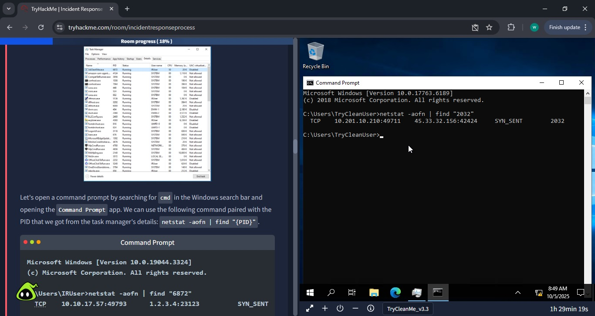

Incident Response Process

<h1>TryHackMe Room – “Incident Response Process” (NIST Incident Response process)</h1>

<h2>Summary:</h2>

I chose to complete a TryHackMe “room” covering the NIST Incident Response process. According to TryHackMe, this room aims to “Practice the NIST Incident Response lifecycle steps on a compromised Windows workstation.”
This activity aligns with both the NIST topic and the Incident Response topic of my Cybersecurity Fundamentals unit at university.

TryHackMe is a cybersecurity training platform with many challenge (essentially “capture the flags”) and walkthrough “rooms” based on specific topics relating to cybersecurity. The walkthrough rooms guide the user through specific challenges related to successfully completing an overall task – in this case the task was to follow the “NIST Incident Response” process.

The general idea of this room was to respond to an “incident” – a user is complaining that their computer is very slow. The task is to identify why the computer is slow. In the process, you discover and remove cryptominer malware, document how the infection happened, document the indicators of compromise, and remove the malware.

The outcome was that I successfully completed the challenges and finished the room (which is to say that I successfully followed the “NIST Incident Response” process).

<h2>Context of the chosen platform, its relevance to cybersecurity learning, and why I selected it:</h2>

TryHackMe is a cybersecurity learning platform that has both free and premium tiers. It includes (at least) 800 “rooms” (the number is continually growing), which fall into the 2 categories of either “walkthroughs” or “challenges”. Walkthroughs are often a mix of informational and guided challenges. Challenges are essentially “capture the flags”, with little to no guidance about how you should do so.

TryHackMe is a very popular cybersecurity learning platform, with over 6 million users, and it is growing very rapidly. It has many beginner-friendly features, including beginner “learning paths” that offer a guided way to approach practical learning in cybersecurity. It also has a “gamified” feel, which may excite beginners, and contribute to continued engagement with the platform.

<h2>Problem/Challenge – Description of the exercise/task attempted, its cybersecurity context, and its relevance:</h2>

The exercise was to act as a member of the “Incident Response Team” and manage an incident on a compromised Windows workstation. The objectives of the room were to “understand the different phases of the incident response process”, and to “apply the process to a realistic scenario as an incident responder”.

<h2>Project Goal/Objectives – What I aimed to achieve from the activity:</h2>

I wanted to learn about the NIST incident response process (“Preparation”, “Detection & Analysis”, “Containment, Eradication & Recovery”, and “Post-Incident Activity”), and gain experience following a realistic scenario with this process.

<h2>Methodology – Step-by-step explanation of how I carried out the activity, tools used, and reasoning for each step.</h2>

a)	Reading/learning about the NIST Incident Response process.

b)	Reading the report from the fictionalised SOC team about the incident.

c)	The “Preparation” step has been completed by the fictionalised organisation, i.e. having a SOC, SEIMs, IDS, EDR, Incident Response teams, etc.

d)	“Detection” has been completed by the user and the SOC team (i.e. the report that was sent to the Incident Response Team)

e)	“Analysis”:

* Report says that computer is extremely slow.
* Look at Windows Task Manager.
* There are no running apps but computer is still very slow.
* Look at background processes.
  
* There is a background process with very high CPU usage: “32th4ckm3.exe”
* Find out that .exe is running from a temporary folder.
  
* Find process ID for 32th4ckm3.exe and use netstat to see if it is utilising network.
  
* Find that 32th4ckm3.exe is sending and receiving on a random port number to a mysterious IP address.
  
* Make notes of all of this information to use later for reporting and as an IOC.
* Make the determination that this .exe is likely to be a “cryptominer.”
  
* Next, determine the infection vector.
* Check the user’s system for browser. The user said they were browsing the web when their computer initially slowed down.
* Open the download folder of Microsoft Edge (the only browser installed).
  
* See a file named “invoice n. 65748224.docm” which was downloaded from a suspicious link: “http://172.233.61.246”. This is also a Word document that includes macros, so is more suspicious as it may contain malicious code.
* When opening the word document, it has no useful content and seems suspicious. Furthermore, although the document has macros, Word doesn’t notify us.
  
* Open “View > Macros” to inspect them, it seems there is indeed a macro, set to auto-open.
  
* When inspecting the code of the macro, the 32th4ckm3.exe program is mentioned twice.
  
* The code also shows that it gets cmd prompt to use certutil to download the cryptominer .exe file in a hidden window.
* Then the code makes a Windows registry entry to add persistence.
  
* Again, there is a need to note all of these details for reporting and IOC reasons.

f)	“Containment, Eradication & Recovery”

* Before the analysis stage, the SOC team detached the computer from the network.
* Go into Task Manager and end the “32th4ckm3.exe” process.
  
* Delete the “32th4ckm3.exe” cryptominer from the temporary folder.
  
* Delete the Word document that downloaded the cryptominer.
  
* Clear the download history to prevent user from accidentally clicking the same link.
  
* To get rid of the persistence, delete the registry key associated with the cryptominer.
  
* (Use IOCs to search the rest of the network later).

g)	“Post-Incident Activity”

* Review incident.
* Document lessons learned.
* Integrate new insights into a newly improved Incident Response Plan
* Back to “Preparation”!

<h2>Reflection:</h2>

<i>What did I learn about cybersecurity concepts and tools from this exercise?</i>

I feel as though I have I learnt a great deal about the NIST Incident Response Process. I found it very helpful to have it demonstrated via a concrete exercise/example. Utilising the example of a cryptominer malware infection was a good idea, it allowed the exercise to demonstrate every aspect of the NIST Incident Response process. This exercise was not particularly heavy on the use of tools, however it allowed the use of netstat, Task Manager, Windows Registry, Word macro inspector to inspect, document and eradicate the cryptominer.

<i>How do I see this experience contributing to my professional growth as a future cybersecurity practitioner?</i>

I feel that it was an excellent exercise and I feel that I learn a great deal by completing it. It gave me a much deeper understanding of both Incident Response, and the NIST CSF. I feel that these skills are going to be useful no matter which role I end up in when working in cybersecurity. NIST is a very widely-used CSF, so any deeper knowledge of this framework would likely be welcome in any organisation that has cybersecurity staff, or even management staff tasked with compliance responsibilities.

<i>Looking back, what would I do differently if you repeated the task?</i>

This primarily was a guided activity, so there wasn’t a great deal of room for errors – however I probably would have tried to document deleting the .exe from the temporary folder correctly, as by the time I had deleted it, I realised that I should have screenshotted it. I got around it by making a note on a screenshot of the folder.

